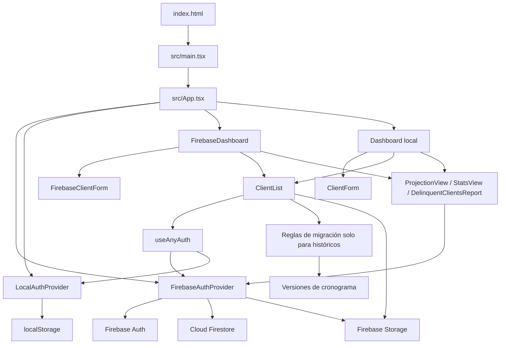
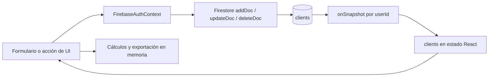
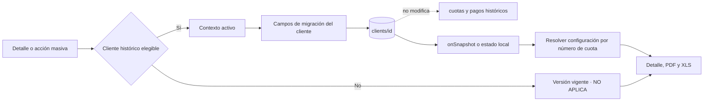

---
tags:
  - arquitectura
  - react
  - firebase
actualizado: 2026-08-21
---

# Arquitectura

[[Inicio|← Inicio]] · [[Funciones-principales]] · [[Flujos-del-sistema]] · [[Base-de-datos]] · [[Mejoras-pendientes]]

## Resumen

El proyecto es una **SPA que ejecuta interfaz, reglas de negocio y acceso a datos en el navegador**. No hay API propia, Cloud Functions ni una capa de repositorios separada. Los contextos React concentran autenticación, estado, persistencia y operaciones de clientes/cuotas; los componentes calculan informes y generan archivos localmente.

## Contenedores y dependencias

> [!warning] Frontera incompleta entre modos
> `ClientList` usa `useAnyAuth`, pero `ProjectionView`, `StatsView` y `DelinquentClientsReport` importan directamente el contexto Firebase. Además, `ClientList` usa Firebase Storage incluso cuando se monta en el panel local. Por ello, el modo local no es independiente de Firebase en todas sus pestañas.

## Arranque y enrutamiento

| Punto | Comportamiento |
|---|---|
| `index.html` | Declara `#root` y carga `src/main.tsx` |
| `src/main.tsx` | Renderiza `<App />` |
| `src/App.tsx` | Monta Query Client, tooltips, notificaciones, `ErrorBoundary` y React Router |
| `/` | `FirebaseAuthProvider` → carga, login o `FirebaseDashboard` |
| `/welcome` | `WelcomeScreen` permite elegir Firebase o local |
| `*` | También abre el flujo Firebase; `NotFoundPage` no se usa |

Las ocho secciones del panel no son rutas: `Dashboard` y `FirebaseDashboard` las manejan como pestañas con estado local (`inicio`, `clientes`, `proyeccion`, `estadisticas`, `reporte`, `pendientes`, `atrasados`, `deudores`).

`ModeSelector`, `pages/Index.tsx` y `pages/NotFound.tsx` están definidos pero no conectados al árbol de rutas efectivo.

## Capas reales

### 1. Composición

- `src/main.tsx` y `src/App.tsx`.
- `QueryClientProvider` está montado, pero no se encontraron `useQuery` ni `useMutation`.
- `ErrorBoundary` captura errores de render y ofrece recargar la página.

### 2. Pantallas

- `FirebaseLogin.tsx` y `Login.tsx`.
- `FirebaseDashboard.tsx` y `Dashboard.tsx`, prácticamente duplicados.
- Los paneles coordinan búsqueda, selección de pestaña y acceso a los componentes funcionales.

### 3. Estado, dominio y persistencia

- `FirebaseAuthContext.tsx`: sesión Firebase, listener Firestore, CRUD, cronogramas, mora, pagos y persistencia de migración; las altas quedan marcadas como no elegibles y la actualización masiva usa lotes de escritura.
- `AuthContext.tsx`: contrato equivalente respaldado por `localStorage`, incluida la exclusión de las altas nuevas del sistema de migración.
- `useAnyAuth.ts`: toma primero el contexto Firebase disponible y, en su defecto, el local.
- `src/types/paymentMigration.ts`: tipos y reglas puras para activar, acotar la cuota de inicio, resolver la versión efectiva y dividir un cronograma.

La migración dispone de tipos compartidos, pero no existe todavía un modelo de dominio completo y único: `User`, `Client` y `Cuota` continúan declarándose en varios contextos, páginas y componentes.

### 4. Componentes funcionales

- `ClientForm` / `FirebaseClientForm`: alta y validación; `addClient` asigna la versión vigente y desactiva explícitamente la elegibilidad de migración.
- `ClientList`: lista, detalle, migración individual y masiva, edición, pagos, adjuntos y exportaciones. Reúne la mayor parte de la operación diaria.
- `ProjectionView`: proyección mensual, por rango y próximos doce meses.
- `StatsView`: estadísticas de cuotas y reporte mensual.
- `DelinquentClientsReport`: cartera atrasada y PDF.

Véase el detalle de símbolos en [[Funciones-principales]].

### 5. Infraestructura

- `src/services/firebase.ts` inicializa `auth`, `db` y `storage`.
- `firebase.json` publica `dist` y redirige cualquier URL a `index.html`.
- `.github/workflows/firebase-deploy.yml` instala pnpm/Node, compila y despliega Hosting al hacer push a `main`.
- `cors.json` configura orígenes y métodos para objetos de Storage.
- `scripts/rewrite_storage_metadata.ps1` actualiza metadatos de caché con `gsutil`.

## Dos modos de ejecución

| Característica | Firebase | Local |
|---|---|---|
| Sesión | Firebase Authentication | Usuario y contraseña validados en el frontend |
| Clientes | Firestore, un conjunto por UID | Clave `clients` en `localStorage` |
| Sincronización | `onSnapshot` en tiempo real | Estado React persistido por efecto |
| Mutaciones | Promesas con `addDoc`, `updateDoc`, `deleteDoc` | Actualizaciones síncronas de estado |
| Adjuntos | Firebase Storage | El componente compartido sigue intentando usar Firebase Storage |
| Cobertura | Ruta predeterminada y todas las pestañas | Accesible en `/welcome`, pero varias vistas requieren contexto Firebase |

## Flujo de datos Firebase

Las cuotas son un arreglo dentro del documento cliente. Cada cambio de una cuota reemplaza el arreglo completo; las consecuencias se detallan en [[Base-de-datos]] y [[Mejoras-pendientes]].

La migración sigue una ruta de escritura deliberadamente distinta:

La elegibilidad usa primero `migracionElegible`. Para documentos históricos que todavía no tienen ese campo, `isLegacyMigrationEligible` conserva compatibilidad considerando elegible únicamente una `versionCronograma` distinta de `CURRENT_PAYMENT_SCHEDULE_VERSION`. Al guardar la configuración de uno de esos clientes se persiste `migracionElegible = true`.

`updateClientMigration` rechaza la activación de altas nuevas. `updateMigratedClientsSchedule` solo cambia la versión objetivo y la fecha de actualización de clientes históricos elegibles con migración activa; no envía ni reemplaza `cuotas`. Los clientes nuevos tampoco se dividen en PDF/XLS. La regla y sus invariantes se detallan en [[Funciones-principales#Migración por cliente]].

## Stack comprobado

- React 19, React Router 6, TypeScript 5.5 y Vite 5 con SWC.
- Firebase SDK 12: Authentication, Firestore y Storage.
- Tailwind CSS y componentes Radix/shadcn.
- Sonner, Lucide, date-fns, jsPDF y jspdf-autotable.
- Supabase figura como dependencia, pero no se usa en `src`.

## Navegación relacionada

- Reglas operativas: [[Funciones-principales]].
- Secuencias completas: [[Flujos-del-sistema]].
- Persistencia: [[Base-de-datos]].
- Riesgos arquitectónicos y refactorización: [[Mejoras-pendientes]].
