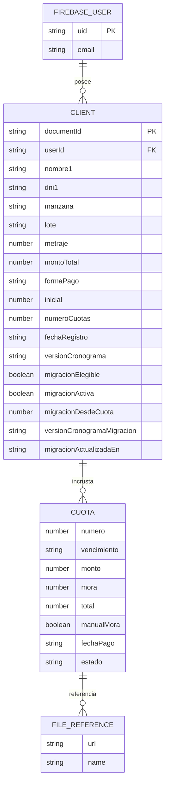
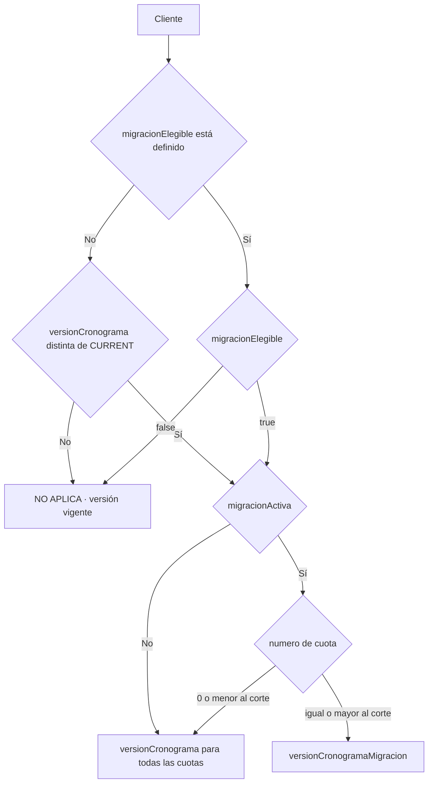
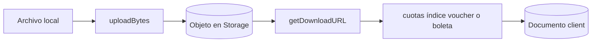

---
tags:
  - base-de-datos
  - firestore
  - storage
actualizado: 2026-08-21
---

# Base de datos

[[Inicio|← Inicio]] · [[Arquitectura]] · [[Funciones-principales]] · [[Flujos-del-sistema]] · [[Mejoras-pendientes]]

## Resumen

No hay backend o servidor propio en este repositorio, ni ORM o base SQL. El frontend usa como backend administrado Firebase Authentication, una única colección raíz de Cloud Firestore, Firebase Storage y un modo alternativo en `localStorage`.

## Modelo conceptual



`CUOTA` y `FILE_REFERENCE` son entidades conceptuales: las cuotas no son documentos separados, sino objetos del arreglo `clients/{id}.cuotas`; los archivos físicos viven en Storage.

## Colección Firestore `clients`

El ID se obtiene de `doc.id` al leer y se añade al objeto en memoria. No se guarda como campo durante el alta.

| Campo | Tipo | Presencia / significado |
|---|---|---|
| `userId` | string | UID propietario; solo en modo Firebase |
| `nombre1` | string | Nombre principal obligatorio |
| `nombre2` | string | Opcional |
| `dni1` | string | Documento principal obligatorio |
| `dni2` | string | Opcional |
| `celular1`, `celular2` | string | Opcionales |
| `email1`, `email2` | string | Opcionales |
| `manzana`, `lote` | string | Identificación comercial del lote |
| `metraje` | number | Área; el formulario usa `0` si no puede convertirla |
| `montoTotal` | number | Valor contractual |
| `formaPago` | `contado` \| `cuotas` | Modalidad declarada |
| `inicial` | number | Opcional en el tipo; normalmente `0` para contado |
| `numeroCuotas` | number | Opcional en el tipo, obligatorio en ambos formularios |
| `fechaRegistro` | string | Fecha `YYYY-MM-DD` generada por el navegador |
| `versionCronograma` | string opcional | Solo el valor actual selecciona el formato nuevo; ausencia u otro valor usan el legado |
| `migracionElegible` | boolean opcional | Las altas nuevas guardan `false`; `true` identifica un histórico habilitado. Si falta, se usa el fallback por `versionCronograma` |
| `migracionActiva` | boolean opcional | `true` habilita la resolución por cuota solo si el cliente también es elegible; ausente o `false` conserva por completo `versionCronograma` |
| `migracionDesdeCuota` | number opcional | Primera cuota regular que usa la nueva configuración; el corte es inclusivo |
| `versionCronogramaMigracion` | string opcional | Versión de presentación/cobranza aplicada desde la cuota de corte |
| `migracionActualizadaEn` | string opcional | Marca temporal ISO de la última activación, cambio de corte, desactivación o actualización oficial |
| `cuotas` | array opcional | Cronograma embebido; puede faltar o estar vacío y el listener intenta generarlo |

### Semántica de migración



Una alta nueva persiste `versionCronograma = CURRENT_PAYMENT_SCHEDULE_VERSION`, `migracionElegible = false` y `migracionActiva = false`; por ello la migración no se ofrece y PDF/XLS conservan una sola configuración vigente. En documentos históricos sin `migracionElegible`, el fallback solo los considera elegibles si `versionCronograma !== CURRENT_PAYMENT_SCHEDULE_VERSION`. Al guardar una migración histórica se fija `migracionElegible = true`.

Para un histórico activo con `migracionDesdeCuota = 10`, las cuotas `1..9` conservan `versionCronograma` y las cuotas `10..N` usan `versionCronogramaMigracion`. La inicial (`numero = 0`) siempre permanece en la configuración base. Desactivar la migración no necesita borrar el corte o la versión objetivo: con `migracionActiva = false`, esos campos no participan en la resolución.

### Objeto `Cuota`

| Campo | Tipo | Uso |
|---|---|---|
| `numero` | number | `0` para inicial; `1..N` para cuotas regulares |
| `vencimiento` | string | `YYYY-MM-DD` |
| `monto` | number | Principal de la cuota |
| `mora` | number opcional | Automática al pagar o fijada manualmente |
| `total` | number opcional | Principal + mora; al generar empieza igual a `monto` |
| `manualMora` | boolean opcional | Hace prevalecer la mora guardada, incluso si es cero |
| `fechaPago` | string opcional | `YYYY-MM-DD` |
| `estado` | string | El modelo admite `pendiente`, `pagado`, `vencido`; el código solo escribe los dos primeros |
| `voucher`, `boleta` | varios formatos | Legado: URL o URL[]; actual: `{url, name}` o arreglo de esos objetos |

Las interfaces de los contextos todavía tipan los adjuntos como `string | string[]`, mientras `ClientList` persiste objetos con nombre. Esta divergencia se registra en [[Mejoras-pendientes]].

## Lecturas y escrituras

### Suscripción principal

```text
collection: clients
where:      userId == firebaseUser.uid
orderBy:    fechaRegistro desc
transport:  onSnapshot
```

Cada usuario Firebase carga únicamente documentos con su UID. Los reportes trabajan después sobre ese arreglo en memoria.

### Operaciones

- Alta: `addDoc(collection(db, "clients"), datos)` con versión vigente, `migracionElegible = false` y `migracionActiva = false`.
- Lectura puntual para cronograma: `getDoc(doc(db, "clients", id))`.
- Edición: `updateDoc`.
- Eliminación: `deleteDoc`.
- Duplicados: `getDocs` de todos los clientes del UID y comparación local de manzana+lote.
- Cuotas: cualquier cambio reemplaza el arreglo `cuotas` completo.
- Migración individual: `updateClientMigration` rechaza la activación de altas nuevas; desde la UI solo guarda clientes históricos y actualiza cinco metadatos, incluido `migracionElegible = true`.
- Actualización oficial: `updateMigratedClientsSchedule` selecciona solo clientes históricos elegibles cuya migración es válida —bandera activa, corte entero positivo y versión objetivo— y actualiza `versionCronogramaMigracion` y `migracionActualizadaEn`; Firebase agrupa las escrituras en lotes.

> [!important] Protección del historial
> Las operaciones de migración no incluyen el campo `cuotas` en su escritura. Por tanto, no reescriben `fechaPago`, `monto`, `estado`, `mora`, `total`, `voucher`, `boleta` ni cualquier otra propiedad embebida de un pago. La actualización oficial cambia configuración de presentación/cobranza, no fechas ni importes del cronograma.

La consulta combinada por `userId` y orden por `fechaRegistro` puede necesitar un índice compuesto. No se incluye `firestore.indexes.json`, así que el índice no es reproducible desde este repositorio.

## Firebase Storage

Los archivos se cargan en:

```text
clients/{clientId}/cuotas/{cuotaIndex}/{base}_{timestamp}_{aleatorio}.{extension}
```



`cors.json` declara una configuración CORS para el hosting de Villa Hermosa y `localhost:5173` / `localhost:3000`. Ni `firebase.json` ni el workflow aplican ese archivo al bucket, por lo que el repositorio no demuestra que sea la configuración remota vigente. El script `rewrite_storage_metadata.ps1` ajusta metadatos de caché usando `gsutil`.

## Modo `localStorage`

| Clave | Contenido |
|---|---|
| `currentUser` | Usuario local autenticado |
| `clients` | Arreglo de clientes con cuotas embebidas |

El esquema es casi el mismo, pero no añade `userId`. Los tres usuarios locales comparten la misma clave `clients` del navegador; no existe separación por usuario.

## Autenticación y propiedad

- Firebase Auth proporciona `uid` y email.
- El rol no se lee de Firestore ni de custom claims: se deriva de un mapa fijo de tres emails en `FirebaseAuthContext`.
- El filtro por `userId` se hace en la consulta del cliente.
- Los documentos sin `userId` no aparecen en esa consulta Firebase.
- No hay código para crear usuarios desde la UI.

## Elementos no versionados

No se encontraron:

- `firestore.rules`.
- `storage.rules`.
- `firestore.indexes.json`.
- migraciones o scripts de evolución de esquema.
- configuración de emuladores.
- validación de esquema del lado servidor.

> [!important]
> Esta ausencia impide auditar desde el repositorio la autorización real del proyecto remoto. Un filtro en el frontend no sustituye reglas de seguridad.

## Invariantes que el código presupone

- Manzana+lote deberían ser únicos dentro de un UID.
- `cuotas[índice]` debe conservar el orden y corresponder al índice usado en la ruta de Storage.
- La inicial, si existe, usa `numero = 0`.
- Toda alta nueva debe guardar la versión vigente, `migracionElegible = false` y `migracionActiva = false`.
- Cuando `migracionElegible` está ausente, solo una versión distinta de la vigente habilita el fallback de cliente histórico.
- La cuota de inicio de una migración es inclusiva: la cuota `N` y todas las posteriores usan la versión objetivo; las anteriores y la inicial usan la base.
- Solo un cliente elegible con `migracionActiva === true` permite aplicar o actualizar la versión objetivo.
- PDF, XLS y actualización masiva deben excluir de la lógica de migración a los clientes con `migracionElegible = false`.
- Una escritura de configuración de migración no debe contener `cuotas`.
- Los importes son números y las fechas son cadenas `YYYY-MM-DD` sin zona horaria; su creación e interpretación no son uniformes entre UTC y hora local.
- La última cuota absorbe diferencias de redondeo o edición.

Riesgos y plan de endurecimiento: [[Mejoras-pendientes]].
