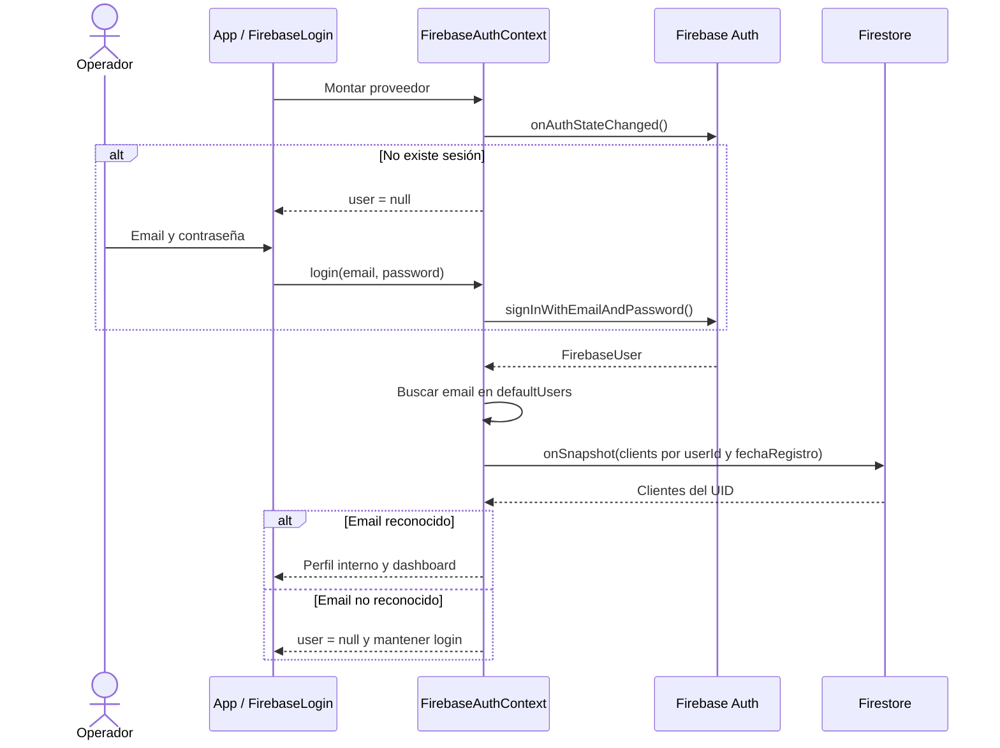
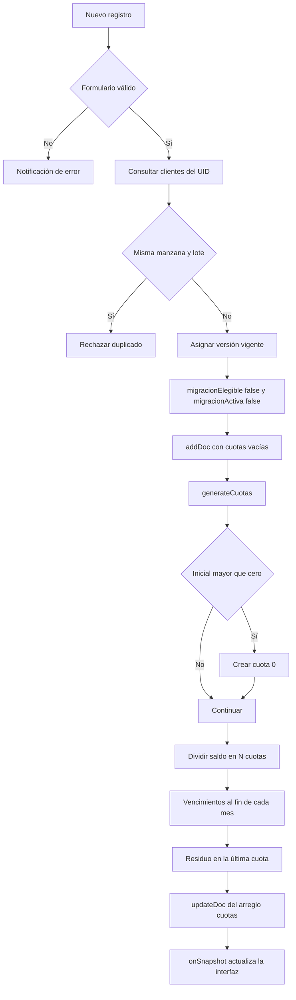
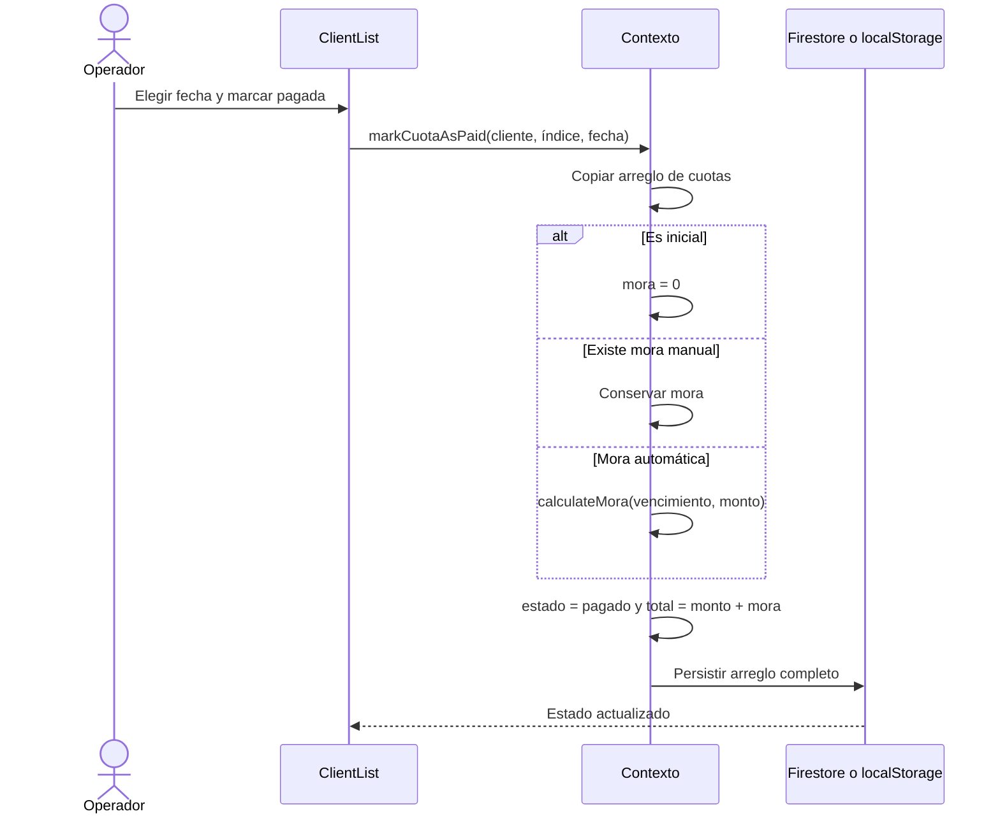
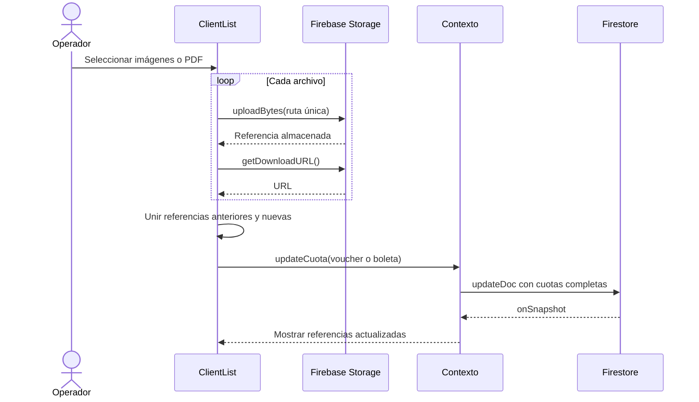
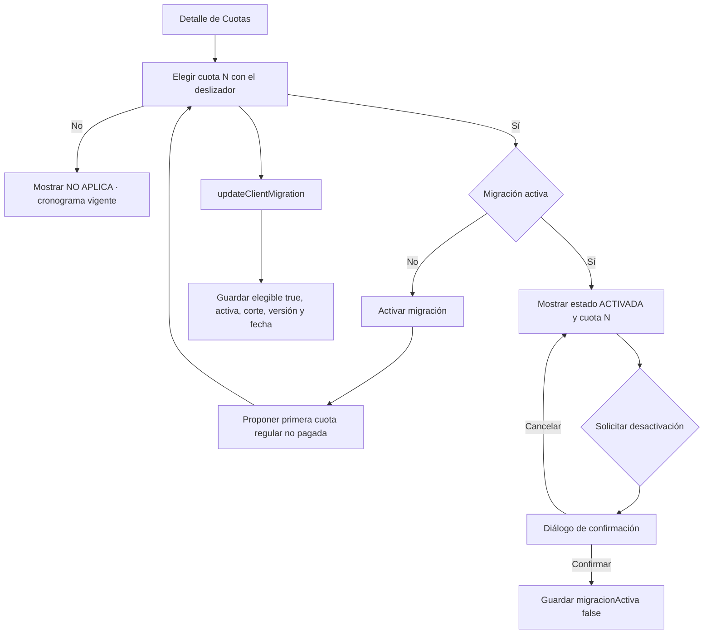
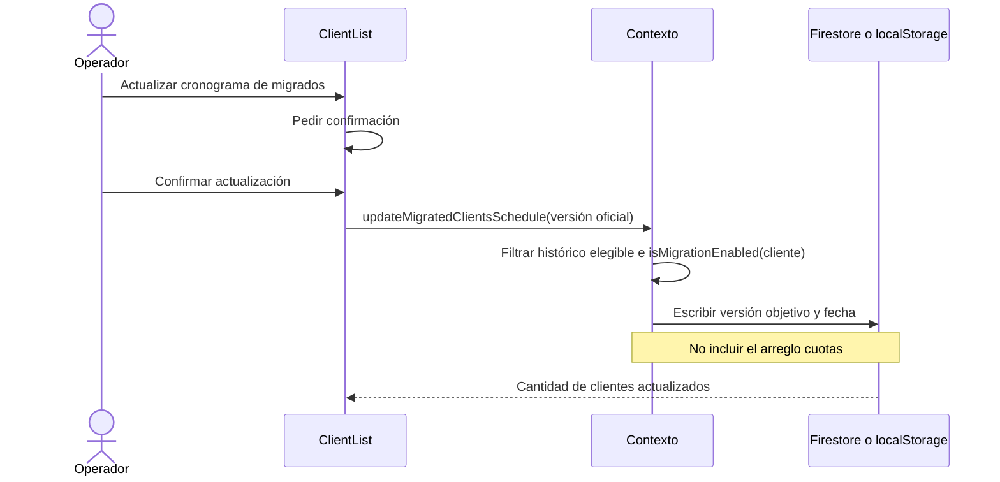
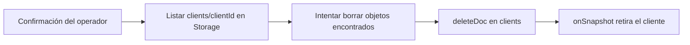
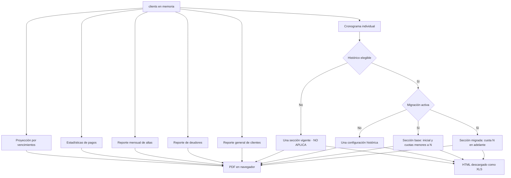

---
tags:
  - flujos
  - secuencias
  - operacion
actualizado: 2026-08-21
---

# Flujos del sistema

[[Inicio|← Inicio]] · [[Arquitectura]] · [[Funciones-principales]] · [[Base-de-datos]] · [[Mejoras-pendientes]]

## 1. Inicio y autenticación Firebase

`/` y cualquier ruta desconocida montan el proveedor Firebase. La pantalla espera a `onAuthStateChanged`; sin una sesión reconocida muestra `FirebaseLogin`. Tras autenticar, el contexto abre una suscripción a clientes del UID, pero solo crea el perfil interno si el email figura en el mapa fijo `defaultUsers`. Un usuario válido de Firebase con otro email conserva `user = null` y sigue viendo el login aunque el listener pueda estar activo.

Si el listener falla, el contexto incrementa `listenerKey` tras 1,5 segundos y vuelve a suscribirse.

## 2. Registro de cliente y cronograma

Hay dos disparadores posibles para la generación: un temporizador de 100 ms después del alta y el listener, que detecta documentos con `cuotas` vacío. `generateCuotas` busca primero el cliente en estado y, si aún no llegó, usa `getDoc`. Toda alta de este flujo queda fuera de migración y usa directamente el cronograma vigente.

## 3. Búsqueda y apertura del detalle

1. `Dashboard` busca sobre `clients` ya cargado; no consulta Firestore por cada búsqueda.
2. Los filtros de manzana y lote aceptan coincidencias parciales.
3. El tercer filtro examina `dni1`, `nombre1` y `nombre2`.
4. Al seleccionar una fila, el panel guarda `selectedClientId` y cambia a la pestaña Clientes.
5. `ClientList` abre el detalle y cronograma correspondiente.

## 4. Edición y pago de una cuota

La edición de monto individual mueve la diferencia a la última cuota. La edición masiva fija un nuevo monto regular y deja el saldo residual en la última. Un vencimiento puede modificarse solo o propagarse a los meses siguientes.

## 5. Carga de voucher o boleta

La ruta física es `clients/{clientId}/cuotas/{cuotaIndex}/{archivoUnico}`. La cuota guarda URL y nombre original; véase [[Base-de-datos#Firebase Storage]].

Vouchers y boletas llegan a este flujo como archivos adjuntos. No se generan como documentos empresariales dentro de la aplicación y la migración no modifica su contenido ni sus referencias.

## 6. Migración individual y actualización oficial

### Activación, corte y desactivación

El marcador explícito `migracionElegible` prevalece. Solo para documentos históricos sin marcador se aplica el fallback `versionCronograma !== CURRENT_PAYMENT_SCHEDULE_VERSION`; el primer guardado consolida `migracionElegible = true`. Un cliente nuevo tiene el marcador en `false`, no puede activar la función y muestra **NO APLICA**.

Para históricos elegibles, el corte es inclusivo: al seleccionar la cuota `N`, las cuotas regulares menores conservan `versionCronograma`, mientras `N` y las posteriores usan `versionCronogramaMigracion`. La inicial (`numero = 0`) conserva siempre la configuración base. Mientras la migración no esté activa, el cliente funciona como antes.

### Actualización masiva al cronograma oficial

Los clientes nuevos, desactivados o con metadatos incompletos quedan fuera. En Firebase las escrituras se fraccionan en lotes para no exceder el límite operativo. Como la mutación solo contiene `versionCronogramaMigracion` y `migracionActualizadaEn`, conserva fechas y montos de pago, estados, mora, totales, vouchers, boletas y cualquier otro dato de `cuotas`. Tampoco recalcula vencimientos o importes: actualiza la versión oficial de presentación/cobranza aplicada desde el corte.

Véanse la regla completa en [[Funciones-principales#Migración por cliente]] y los campos en [[Base-de-datos#Semántica de migración]].

## 7. Eliminación de cliente

La implementación intenta limpiar Storage antes de Firestore, pero solo recorre la raíz y un nivel adicional; los archivos reales están un nivel más profundo, bajo `cuotas/{cuotaIndex}`. Este hallazgo está priorizado en [[Mejoras-pendientes]].

## 8. Informes

No se guardan reportes ni agregados en la base de datos. Todo se calcula y descarga desde el navegador. Un cliente nuevo queda excluido de la partición y genera una sola sección vigente. En un cliente histórico migrado, las dos secciones conservan las filas y el formato tabular, pero cada una resuelve sus logos, proyecto, cobranza y datos bancarios con la versión que corresponde.

## 9. Modo local

Desde `/welcome`, el operador puede elegir modo local:

1. `LocalAuthProvider` restaura `currentUser` y `clients` desde `localStorage`.
2. `Login` valida usuario y contraseña dentro del frontend.
3. Las mutaciones cambian estado React y el efecto persiste `clients`.
4. La lógica de cronograma y mora replica la del contexto Firebase.

> [!caution] Limitación actual
> Proyecciones, estadísticas y deudores requieren directamente `FirebaseAuthContext`, y los adjuntos de `ClientList` siguen usando Firebase Storage. El flujo local completo no está aislado ni funciona de manera homogénea.

## Reglas transversales

- Las cuotas regulares tienen `numero > 0`; la inicial es `0`.
- Las fechas se almacenan como `YYYY-MM-DD`.
- Las mutaciones Firebase se reflejan de vuelta mediante `onSnapshot`.
- Los roles se muestran en el encabezado, pero no alteran estos flujos.
- Las operaciones sobre cuotas reemplazan el arreglo completo del cliente.
- Las operaciones de configuración de migración son la excepción: escriben solo metadatos del cliente y no reemplazan `cuotas`.

Modelo persistido: [[Base-de-datos]]. Reglas de cálculo: [[Funciones-principales]].
