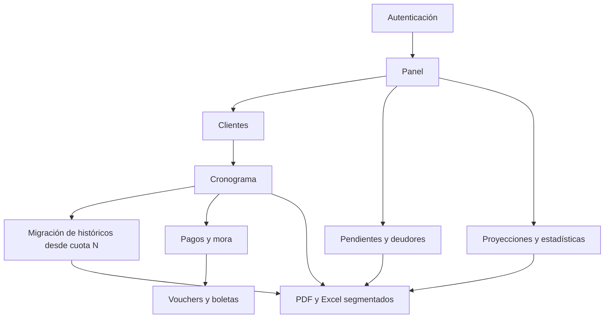
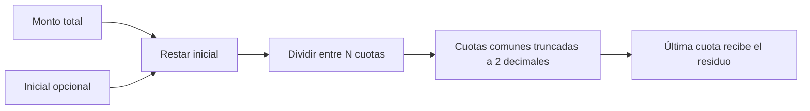
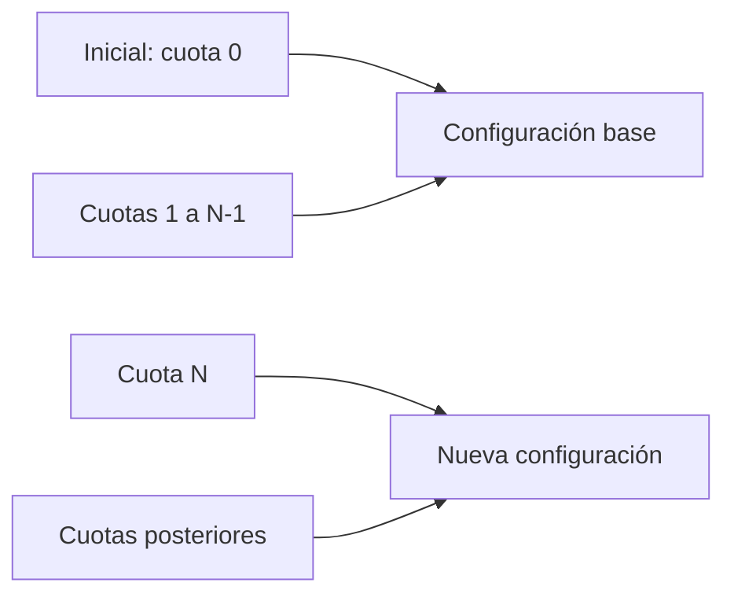

---
tags:
  - funciones
  - reglas-de-negocio
  - pagos
actualizado: 2026-08-21
---

# Funciones principales

[[Inicio|← Inicio]] · [[Arquitectura]] · [[Flujos-del-sistema]] · [[Base-de-datos]] · [[Mejoras-pendientes]]

## Mapa funcional

## Autenticación y sesión

| Función | Ubicación | Responsabilidad |
|---|---|---|
| `FirebaseAppContent` | `src/App.tsx` | Espera la restauración de sesión y decide entre login y panel |
| `onAuthStateChanged` | `FirebaseAuthContext.tsx` | Mantiene `firebaseUser` y deriva el perfil interno desde un mapa de emails |
| `login` / `logout` | Ambos contextos | Inicia o cierra sesión en Firebase; en local usa credenciales incluidas en el frontend |
| Listener `onSnapshot` | `FirebaseAuthContext.tsx` | Sincroniza en tiempo real los clientes cuyo `userId` coincide con el UID |

Los perfiles posibles son `admin`, `full` y `readonly`, pero el código funcional no aplica permisos distintos. Véase [[Mejoras-pendientes#P0 — Seguridad y privacidad]].

## Clientes y búsqueda

### Alta

`ClientForm` y `FirebaseClientForm` exigen nombre, DNI, manzana, lote, monto total, forma de pago y número de cuotas; para `formaPago === "cuotas"` también exigen inicial. Convierten importes y metraje desde texto y llaman a `addClient`.

`addClient`:

1. Comprueba manzana+lote duplicados.
2. Añade fecha de registro y `versionCronograma = CURRENT_PAYMENT_SCHEDULE_VERSION`.
3. Marca expresamente `migracionElegible = false` y `migracionActiva = false` para que el alta no ingrese al circuito histórico.
4. En Firebase añade `userId` y crea el documento con `cuotas: []`.
5. Dispara `generateCuotas` después del alta.

La comprobación Firebase lee todos los clientes del UID y compara manzana/lote normalizados en el navegador.

### Consulta y mantenimiento

| Símbolo | Uso |
|---|---|
| `searchClients` | Coincidencia parcial por manzana, lote, `dni1`, `nombre1` o `nombre2` |
| `updateClient` | Actualización parcial del documento o del objeto local |
| `deleteClient` | Intenta borrar adjuntos y después elimina el cliente |
| `savePhoneEdit` / `saveEmailEdit` | Editan los dos teléfonos o correos desde `ClientList` |
| `getFilteredClients` | Lista completa, pendientes del mes o clientes con atraso |
| `getClientStatus` | Devuelve `Sin cuotas`, `Completado` o `Debe N` |

## Cronograma de cuotas

`generateCuotas` aplica la misma regla en Firebase y local:

1. Si `inicial > 0`, crea la cuota número `0`, con vencimiento igual a `fechaRegistro`, estado `pendiente` y sin mora.
2. Calcula el saldo: `montoTotal - inicial`.
3. Divide el saldo entre `numeroCuotas` y trunca cada cuota común a dos decimales.
4. Fija vencimientos al último día de cada mes, empezando por el mes siguiente al registro.
5. La última cuota absorbe el residuo para cuadrar el saldo.

El generador no consulta `formaPago`: si existe `numeroCuotas`, también puede crear cronograma para una venta marcada al contado. Otros reportes, en cambio, tratan esas ventas como totalmente pagadas.

## Mora y registro de pagos

`calculateMora(vencimiento, monto)` calcula días vencidos a medianoche local:

- Días 0–5 después del vencimiento: sin mora.
- Días 6–14: 1 % del monto por día contado desde el día 6.
- Desde el día 15: conserva el 9 % acumulado y suma 1,5 % por cada día adicional.

`markCuotaAsPaid`:

1. Usa mora cero para la inicial.
2. Respeta `mora` cuando `manualMora === true`.
3. En otro caso calcula la mora automática.
4. Guarda `fechaPago`, `estado: "pagado"`, `mora` y `total = monto + mora`.

La mora automática se calcula con la fecha actual del equipo, no con la fecha de pago elegida. Las ediciones disponibles en `ClientList` permiten:

- Cambiar una cuota y trasladar la diferencia a la última.
- Cambiar el monto regular de todas las cuotas y recalcular la última.
- Editar la mora manual.
- Modificar un vencimiento o propagar fechas posteriores al último día de cada mes.

## Vouchers y boletas

`handleFileUpload` acepta varias imágenes o PDF. Cada archivo se guarda en Firebase Storage y la cuota recibe una referencia `{ url, name }`. Las referencias antiguas en formato URL simple se normalizan al leerlas.

Vouchers y boletas son **adjuntos aportados por el operador**. El repositorio no contiene un generador de boletas ni aplica una plantilla empresarial a esos archivos; la selección de configuración por migración opera sobre el cronograma visible y sus exportaciones PDF/XLS.

`downloadAllFiles` intenta descargar cada objeto mediante `fetch`; si CORS lo impide, abre la URL en otra pestaña. `openAllFiles` abre directamente cada referencia.

La estructura física y el modelo exacto están en [[Base-de-datos#Firebase Storage]].

## Proyecciones, estadísticas y reportes

| Vista | Cálculo real | Exportación |
|---|---|---|
| `ProjectionView` | Suma todas las cuotas regulares por vencimiento, incluso si ya están pagadas; ofrece mes, rango y próximos 12 meses | PDF |
| `StatsView` | Para financiados: cuotas proyectadas, pagadas, pendientes y adelantadas por mes | PDF |
| `StatsView showReport` | Altas del mes usando fecha de inicial o registro; separa iniciales y ventas al contado | PDF detallado |
| `DelinquentClientsReport` | Cuotas regulares no pagadas con vencimiento anterior a hoy; filtra por 1, 2, 3 o 4+ | PDF apaisado |
| `ClientList` | Cronograma individual y reporte general agrupado por financiados/contado | PDF y `.xls` basado en HTML |

Los cálculos se realizan sobre el arreglo `clients` ya cargado; no hay consultas agregadas en Firestore.

## Formato versionado de cronograma

`CURRENT_PAYMENT_SCHEDULE_VERSION` vale `ayt-interbank-2026-08-13`. Al crear un cliente se guarda esa versión junto con `migracionElegible = false`; por ello, las altas nuevas usan directamente el formato vigente y no necesitan migración. `ClientList` elige entre configuración antigua y actual para logos, proyecto, cobranza y datos bancarios al exportar. `OFFICIAL_MIGRATION_SCHEDULE_VERSION` identifica la versión oficial que puede asignarse a clientes históricos migrados.

Este versionado gobierna presentación y cobranza; no reemplaza vencimientos, montos ni pagos dentro de `cuotas`.

## Migración por cliente

Esta función se aplica **exclusivamente a clientes históricos del registro antiguo**. En **Detalle de Cuotas**, junto al DNI, un cliente elegible puede activar la migración y seleccionar una cuota regular mediante un deslizador. La interfaz muestra el estado y el número elegido. Si se intenta desactivar, un diálogo exige confirmar la acción antes de persistir `migracionActiva = false`.

Las altas nuevas muestran **Migración: NO APLICA**, no presentan controles de activación y continúan siempre con `CURRENT_PAYMENT_SCHEDULE_VERSION`. La elegibilidad se resuelve así:

1. Si `migracionElegible` existe, su valor explícito decide; por tanto, `false` protege a todo cliente nuevo.
2. Si el campo falta por tratarse de un documento histórico, se considera elegible cuando `versionCronograma !== CURRENT_PAYMENT_SCHEDULE_VERSION`.
3. Al guardar por primera vez la migración de un histórico inferido, se fija `migracionElegible = true` para dejar de depender del fallback.

La frontera es inclusiva:

Por ejemplo, con `migracionDesdeCuota = 10`, las cuotas 1–9 siguen en la configuración base y la cuota 10 en adelante usa `versionCronogramaMigracion`. Si la migración está desactivada, `versionCronograma` rige todas las cuotas aunque se conserven el corte y la versión objetivo como metadatos.

Las reglas puras de `src/types/paymentMigration.ts` concentran esta decisión:

| Símbolo | Responsabilidad |
|---|---|
| `isLegacyMigrationEligible` | Respeta el marcador explícito y aplica el fallback por versión solo a documentos históricos sin marcador |
| `getSuggestedMigrationStart` | Propone la primera cuota regular no pagada; si no existe, usa la última regular disponible |
| `clampMigrationStart` | Limita el corte al rango real de cuotas regulares |
| `isMigratedInstallment` | Comprueba si una cuota cae en la nueva configuración |
| `getEffectiveScheduleVersion` | Resuelve la versión base u objetivo para una cuota concreta |
| `splitInstallmentsByMigration` | Divide las cuotas en secciones base y migrada sin duplicarlas ni perderlas |

`updateClientMigration` valida la elegibilidad y persiste la elección individual de un cliente histórico, incluyendo `migracionElegible = true`. `updateMigratedClientsSchedule` permite llevar **todos y solo** los clientes históricos elegibles y activos a la versión oficial registrada. Las altas nuevas quedan excluidas aunque se intente alterar sus metadatos mediante una edición ordinaria. La actualización masiva cambia `versionCronogramaMigracion` y `migracionActualizadaEn`; no envía `cuotas`, de modo que conserva los pagos históricos y sus adjuntos.

### Aplicación en documentos

- Un cliente nuevo genera PDF y XLS con una sola sección de la configuración vigente; nunca entra en la partición de migración.
- Un cliente histórico elegible sin migración activa conserva una sola sección y su configuración previa.
- Con migración activa, el cronograma se divide automáticamente en una sección base y otra migrada; cada una usa sus logos, proyecto, contacto de cobranza y cuenta bancaria correspondientes.
- La cuota inicial permanece en la sección base incluso si el corte es la cuota 1.
- La segmentación cambia la presentación, no el formato tabular ni los datos financieros de cada fila.

Persistencia e invariantes: [[Base-de-datos#Semántica de migración]]. Secuencias operativas: [[Flujos-del-sistema#6. Migración individual y actualización oficial]].

## Pendientes y atrasos

- **Pendiente del mes**: cuota regular con vencimiento en el mes/año actual y estado `pendiente`.
- **Atrasada**: cuota regular no pagada cuyo vencimiento es anterior a hoy.
- **Deudor**: cliente con al menos una cuota atrasada según `DelinquentClientsReport`.
- La inicial, identificada por `numero === 0`, se excluye de estas listas.

Los flujos que conectan estas operaciones se ilustran en [[Flujos-del-sistema]].
