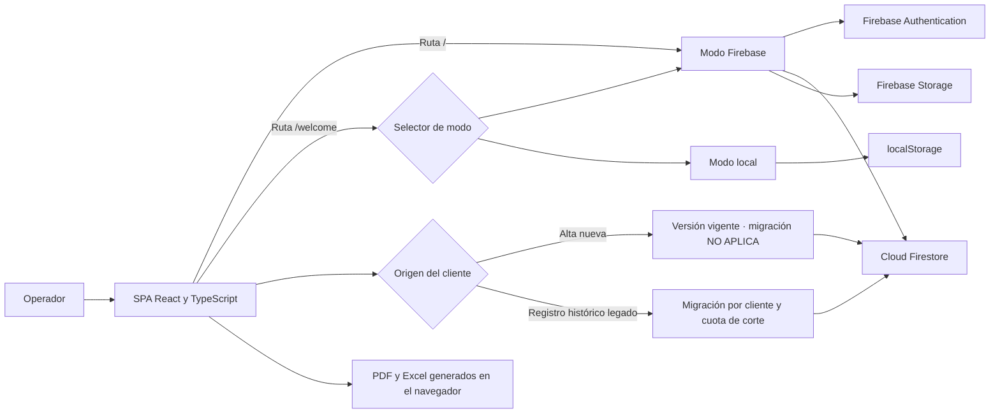

---
tags:
  - documentacion
  - indice
  - bienes-raices
actualizado: 2026-08-21
---

# Inicio

> [!summary] Propósito
> Este vault documenta el comportamiento observado en el código de **Control Bienes Raíces**, una SPA para administrar clientes, lotes, cronogramas, pagos, adjuntos, proyecciones y reportes del proyecto Villa Hermosa. La ruta principal trabaja con Firebase; `/welcome` conserva un modo alternativo basado en `localStorage`.

## Mapa del vault

- [[Arquitectura]] — módulos, dependencias, rutas y modos de ejecución.
- [[Funciones-principales]] — catálogo de operaciones y reglas de negocio.
- [[Flujos-del-sistema]] — secuencias de autenticación, altas, pagos y archivos.
- [[Base-de-datos]] — modelo Firestore, estructura local y Firebase Storage.
- [[Mejoras-pendientes]] — hallazgos confirmados y backlog priorizado.

## Vista rápida del sistema

## Estado real observado

| Aspecto | Implementación actual |
|---|---|
| Aplicación | React 19, TypeScript y Vite; no hay servidor propio en este repositorio |
| Acceso predeterminado | Firebase Authentication en `/` y también para cualquier ruta no reconocida |
| Persistencia principal | Colección Firestore `clients`, filtrada por el UID autenticado |
| Adjuntos | Firebase Storage; las referencias quedan dentro de cada cuota |
| Alternativa | Usuarios, sesión y clientes en `localStorage`, accesibles desde `/welcome` |
| Interfaz | Tailwind CSS, Radix UI/shadcn, Sonner y Lucide |
| Migración | Exclusiva para clientes históricos elegibles; usa una cuota inicial inclusiva y permite actualizar la versión oficial sin reescribir pagos |
| Altas nuevas | Se guardan con la versión vigente, `migracionElegible = false` y `migracionActiva = false`; la interfaz muestra **NO APLICA** |
| Informes | jsPDF, jspdf-autotable y un archivo HTML descargado con extensión `.xls`; solo un cliente histórico con migración activa se segmenta por configuración |
| Despliegue | GitHub Actions compila con pnpm y publica `dist` en Firebase Hosting |
| Pruebas | No hay script ni archivos de pruebas de primera parte |

## Capacidades visibles

1. Inicio de sesión y restauración de sesión.
2. Registro y búsqueda de clientes por manzana, lote, DNI o nombre.
3. Generación de una inicial y cuotas mensuales.
4. Edición de contactos, montos, vencimientos y mora.
5. Registro de pagos y carga de vouchers o boletas.
6. Listados de pendientes, atrasados y deudores.
7. Proyecciones, estadísticas y reportes mensuales.
8. Migración individual de clientes históricos desde una cuota y actualización masiva de los históricos ya migrados.
9. Exportación de cronogramas y reportes: los nuevos mantienen una sola configuración vigente y los históricos migrados pueden tener dos secciones.

## Cómo leer estas notas

La documentación distingue entre:

- **Comportamiento comprobado**: presente en `src/`, la configuración o el workflow.
- **Ausencia en el repositorio**: por ejemplo, no se versionan reglas de Firestore o Storage. Esto no prueba cómo está configurado el proyecto remoto, solo que no puede auditarse desde este código.
- **Recomendación**: propuesta que todavía no está implementada.

El recorrido sugerido es [[Arquitectura]] → [[Funciones-principales]] → [[Flujos-del-sistema]] → [[Base-de-datos]] → [[Mejoras-pendientes]].

## Fuentes principales analizadas

- `src/App.tsx`, `src/main.tsx` y `src/pages/`.
- `src/context/AuthContext.tsx` y `src/context/FirebaseAuthContext.tsx`.
- `src/types/paymentMigration.ts` y `src/config/paymentSchedule.ts`.
- `src/components/ClientList.tsx`, formularios, proyecciones, estadísticas y reportes.
- `src/services/firebase.ts`, `firebase.json`, `cors.json` y el workflow de despliegue.

---

Volver a esta nota desde cualquier página: [[Inicio]].
